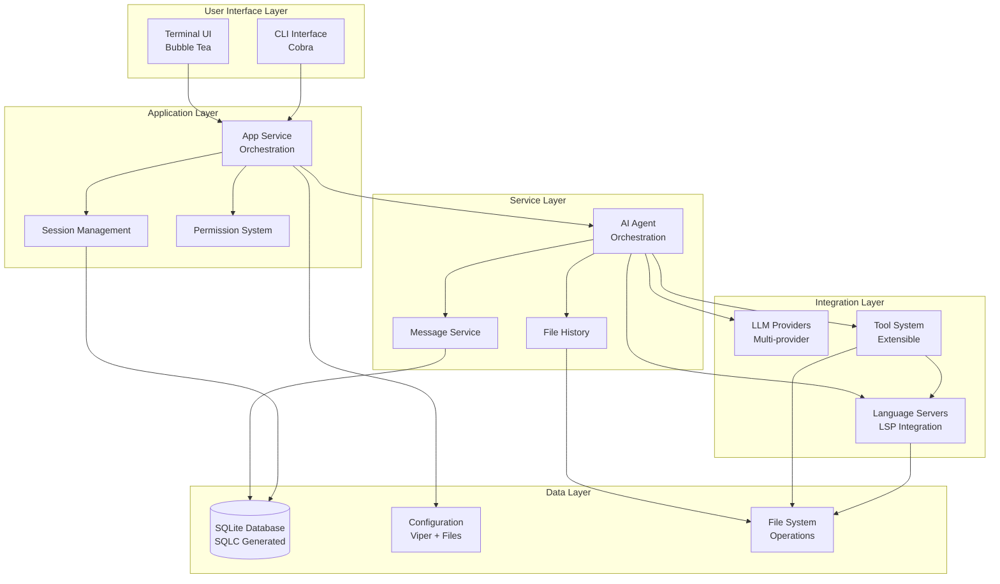
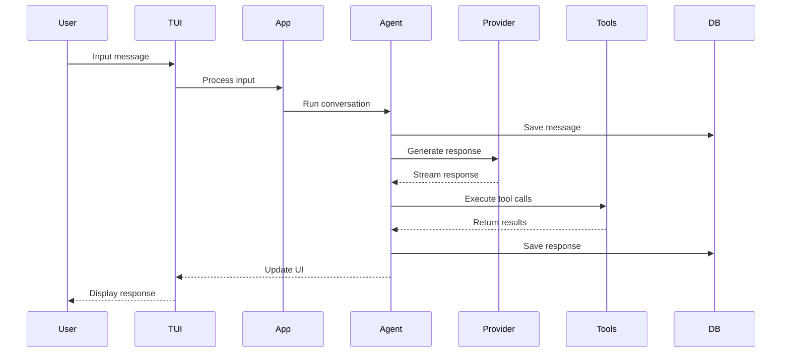
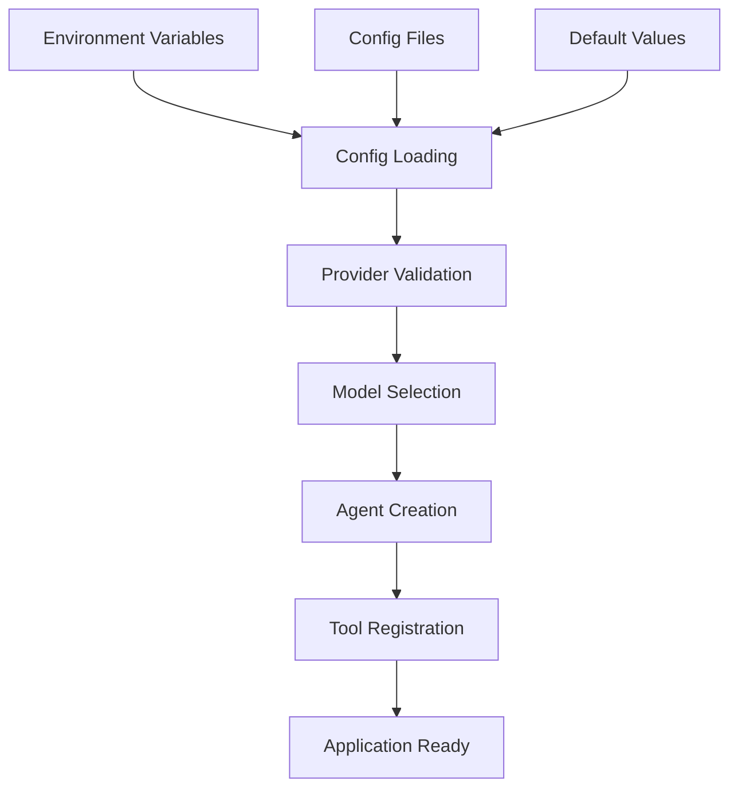
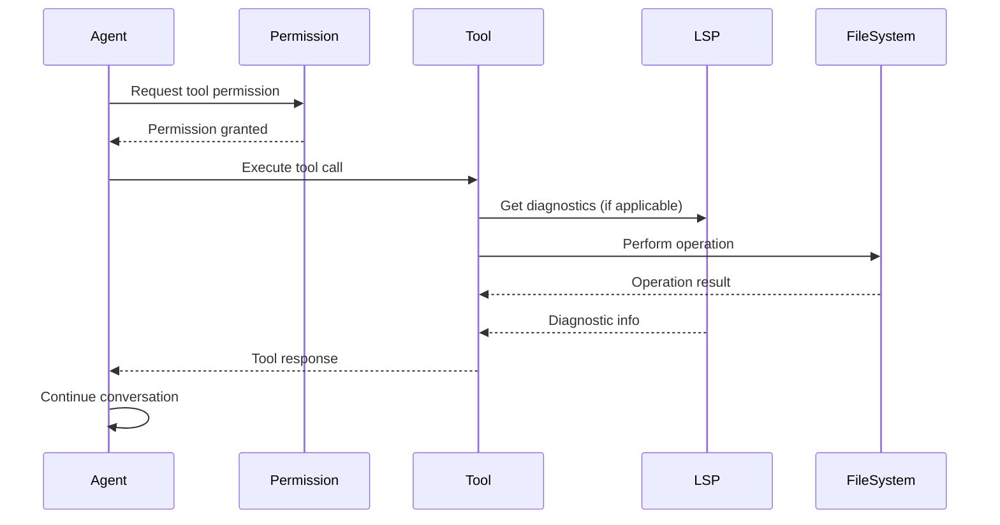

# OpenCode Architecture Documentation

## Overview

OpenCode is a sophisticated terminal-based AI coding assistant built in Go, designed to provide intelligent development assistance through a rich Terminal User Interface (TUI). It integrates multiple Large Language Model (LLM) providers, Language Server Protocol (LSP) support, and a comprehensive tool ecosystem to help developers with coding tasks, debugging, and code understanding.

## Project Structure

```
opencode/
├── .claude/                          # Claude AI configuration
├── .git/                             # Git repository data
├── .github/                          # GitHub workflows and CI/CD
│   └── workflows/
│       ├── build.yml
│       └── release.yml
├── .opencode/                        # Local application data
│   ├── commands/                     # User custom commands
│   ├── init                          # Initialization script
│   ├── opencode.db                   # SQLite database
│   ├── opencode.db-shm               # SQLite shared memory
│   └── opencode.db-wal               # SQLite WAL file
├── cmd/                              # CLI interface and commands
│   ├── root.go                       # Main CLI command definition
│   └── schema/                       # Configuration schema generation
│       ├── README.md
│       └── main.go
├── internal/                         # Core application logic
│   ├── app/                          # Application orchestration
│   │   ├── app.go                    # Main app service
│   │   └── lsp.go                    # LSP integration
│   ├── completions/                  # Shell completion logic
│   │   └── files-folders.go
│   ├── config/                       # Configuration management
│   │   ├── config.go                 # Configuration types and loading
│   │   └── init.go                   # Initialization logic
│   ├── db/                           # Database layer (SQLite + SQLC)
│   │   ├── connect.go                # Database connection
│   │   ├── db.go                     # Database interface
│   │   ├── embed.go                  # Embedded migrations
│   │   ├── files.sql.go              # Generated file queries
│   │   ├── messages.sql.go           # Generated message queries
│   │   ├── models.go                 # Generated database models
│   │   ├── querier.go                # Generated query interface
│   │   ├── sessions.sql.go           # Generated session queries
│   │   ├── migrations/               # Database migrations
│   │   │   ├── 20250424200609_initial.sql
│   │   │   └── 20250515105448_add_summary_message_id.sql
│   │   └── sql/                      # SQL query definitions
│   │       ├── files.sql
│   │       ├── messages.sql
│   │       └── sessions.sql
│   ├── diff/                         # File diff and patch utilities
│   │   ├── diff.go
│   │   └── patch.go
│   ├── fileutil/                     # File system utilities
│   │   └── fileutil.go
│   ├── format/                       # Output formatting
│   │   ├── format.go                 # Text/JSON output formatting
│   │   └── spinner.go                # Loading spinner for CLI
│   ├── history/                      # File change history
│   │   └── file.go
│   ├── llm/                          # LLM integration layer
│   │   ├── agent/                    # AI agent orchestration
│   │   │   ├── agent-tool.go         # Agent tool integration
│   │   │   ├── agent.go              # Core agent logic
│   │   │   ├── mcp-tools.go          # MCP tool integration
│   │   │   └── tools.go              # Tool definitions
│   │   ├── models/                   # Model definitions and metadata
│   │   │   ├── anthropic.go          # Anthropic model definitions
│   │   │   ├── azure.go              # Azure OpenAI models
│   │   │   ├── copilot.go            # GitHub Copilot models
│   │   │   ├── gemini.go             # Google Gemini models
│   │   │   ├── groq.go               # GROQ models
│   │   │   ├── local.go              # Local model support
│   │   │   ├── models.go             # Model registry and metadata
│   │   │   ├── openai.go             # OpenAI models
│   │   │   ├── openrouter.go         # OpenRouter models
│   │   │   ├── vertexai.go           # Google VertexAI models
│   │   │   └── xai.go                # xAI models
│   │   ├── prompt/                   # Prompt engineering and templates
│   │   │   ├── coder.go              # Coding assistant prompts
│   │   │   ├── prompt.go             # Base prompt types
│   │   │   ├── prompt_test.go        # Prompt testing
│   │   │   ├── summarizer.go         # Context summarization
│   │   │   ├── task.go               # Task-specific prompts
│   │   │   └── title.go              # Title generation prompts
│   │   ├── provider/                 # LLM provider implementations
│   │   │   ├── anthropic.go          # Anthropic Claude integration
│   │   │   ├── azure.go              # Azure OpenAI integration
│   │   │   ├── bedrock.go            # AWS Bedrock integration
│   │   │   ├── copilot.go            # GitHub Copilot integration
│   │   │   ├── gemini.go             # Google Gemini integration
│   │   │   ├── openai.go             # OpenAI integration
│   │   │   ├── provider.go           # Provider interface and common logic
│   │   │   ├── provider_test.go      # Provider testing
│   │   │   └── vertexai.go           # Google VertexAI integration
│   │   └── tools/                    # AI tool implementations
│   │       ├── bash.go               # Shell command execution
│   │       ├── diagnostics.go        # LSP diagnostics integration
│   │       ├── edit.go               # File editing operations
│   │       ├── fetch.go              # HTTP/web content fetching
│   │       ├── file.go               # File operations
│   │       ├── glob.go               # File pattern matching
│   │       ├── grep.go               # Text search operations
│   │       ├── ls.go                 # Directory listing
│   │       ├── ls_test.go            # Directory listing tests
│   │       ├── patch.go              # File patching operations
│   │       ├── sourcegraph.go        # Sourcegraph code search
│   │       ├── tools.go              # Tool registry and interface
│   │       ├── view.go               # File viewing operations
│   │       ├── write.go              # File writing operations
│   │       └── shell/                # Shell integration utilities
│   │           └── shell.go
│   ├── logging/                      # Structured logging system
│   │   ├── logger.go                 # Core logging functionality
│   │   ├── message.go                # Message-specific logging
│   │   └── writer.go                 # Log writers and output
│   ├── lsp/                          # Language Server Protocol integration
│   │   ├── client.go                 # LSP client implementation
│   │   ├── handlers.go               # LSP message handlers
│   │   ├── language.go               # Language-specific configurations
│   │   ├── methods.go                # LSP method implementations
│   │   ├── transport.go              # LSP transport layer
│   │   ├── protocol.go               # LSP protocol definitions
│   │   ├── protocol/                 # LSP protocol types
│   │   │   ├── LICENSE               # Protocol license
│   │   │   ├── interface.go          # Protocol interfaces
│   │   │   ├── pattern_interfaces.go # Pattern matching interfaces
│   │   │   ├── tables.go             # Protocol tables
│   │   │   ├── tsdocument-changes.go # Document change tracking
│   │   │   ├── tsjson.go             # JSON protocol handling
│   │   │   ├── tsprotocol.go         # TypeScript protocol definitions
│   │   │   └── uri.go                # URI handling
│   │   ├── util/                     # LSP utilities
│   │   │   └── edit.go               # Edit operation utilities
│   │   └── watcher/                  # File watching for LSP
│   │       └── watcher.go
│   ├── message/                      # Message handling system
│   │   ├── attachment.go             # File attachments
│   │   ├── content.go                # Message content types
│   │   └── message.go                # Core message logic
│   ├── permission/                   # Permission and security system
│   │   └── permission.go
│   ├── pubsub/                       # Event system
│   │   ├── broker.go                 # Event broker
│   │   └── events.go                 # Event definitions
│   ├── session/                      # Session management
│   │   └── session.go
│   ├── tui/                          # Terminal User Interface
│   │   ├── tui.go                    # Main TUI orchestration
│   │   ├── components/               # UI components
│   │   │   ├── chat/                 # Chat interface components
│   │   │   │   ├── chat.go           # Chat container
│   │   │   │   ├── editor.go         # Message editor
│   │   │   │   ├── list.go           # Message list
│   │   │   │   ├── message.go        # Individual messages
│   │   │   │   └── sidebar.go        # Chat sidebar
│   │   │   ├── core/                 # Core UI components
│   │   │   │   └── status.go         # Status bar
│   │   │   ├── dialog/               # Modal dialogs
│   │   │   │   ├── arguments.go      # Command argument dialogs
│   │   │   │   ├── commands.go       # Command selection dialog
│   │   │   │   ├── complete.go       # Completion dialogs
│   │   │   │   ├── custom_commands.go # Custom command dialog
│   │   │   │   ├── custom_commands_test.go # Custom command tests
│   │   │   │   ├── filepicker.go     # File picker dialog
│   │   │   │   ├── help.go           # Help dialog
│   │   │   │   ├── init.go           # Initialization dialog
│   │   │   │   ├── models.go         # Model selection dialog
│   │   │   │   ├── permission.go     # Permission dialog
│   │   │   │   ├── quit.go           # Quit confirmation dialog
│   │   │   │   ├── session.go        # Session selection dialog
│   │   │   │   └── theme.go          # Theme selection dialog
│   │   │   ├── logs/                 # Log viewing components
│   │   │   │   ├── details.go        # Log detail view
│   │   │   │   └── table.go          # Log table view
│   │   │   └── util/                 # UI utilities
│   │   │       └── simple-list.go    # Simple list component
│   │   ├── image/                    # Image handling for TUI
│   │   │   └── images.go
│   │   ├── layout/                   # Layout management
│   │   │   ├── container.go          # Container layouts
│   │   │   ├── layout.go             # Layout utilities
│   │   │   ├── overlay.go            # Overlay management
│   │   │   └── split.go              # Split pane layouts
│   │   ├── page/                     # Page management
│   │   │   ├── chat.go               # Chat page
│   │   │   ├── logs.go               # Logs page
│   │   │   └── page.go               # Page interface
│   │   ├── styles/                   # UI styling
│   │   │   ├── background.go         # Background styles
│   │   │   ├── icons.go              # Icon definitions
│   │   │   ├── markdown.go           # Markdown rendering styles
│   │   │   └── styles.go             # Core styles
│   │   ├── theme/                    # Theme system
│   │   │   ├── catppuccin.go         # Catppuccin theme
│   │   │   ├── dracula.go            # Dracula theme
│   │   │   ├── flexoki.go            # Flexoki theme
│   │   │   ├── gruvbox.go            # Gruvbox theme
│   │   │   ├── manager.go            # Theme manager
│   │   │   ├── monokai.go            # Monokai theme
│   │   │   ├── onedark.go            # OneDark theme
│   │   │   ├── opencode.go           # OpenCode default theme
│   │   │   ├── theme.go              # Theme interface
│   │   │   ├── theme_test.go         # Theme tests
│   │   │   ├── tokyonight.go         # Tokyo Night theme
│   │   │   └── tron.go               # Tron theme
│   │   └── util/                     # TUI utilities
│   │       └── util.go
│   └── version/                      # Version information
│       └── version.go
├── sandbox/                          # Development sandbox
│   └── zoo-simulator/
│       └── zoo.py
├── scripts/                          # Build and utility scripts
│   ├── check_hidden_chars.sh         # Character validation script
│   ├── release                       # Release script
│   └── snapshot                      # Snapshot build script
├── .gitignore                        # Git ignore rules
├── .goreleaser.yml                   # GoReleaser configuration
├── .opencode.json                    # Local configuration file
├── AGENT.md                          # Agent development guide
├── LICENSE                           # MIT license
├── OpenCode.md                       # Development commands and conventions
├── README.md                         # Main project documentation
├── checklist-plan.md                 # Development checklist
├── go.mod                            # Go module definition
├── go.sum                            # Go module checksums
├── install                           # Installation script
├── main.go                           # Application entry point
├── opencode                          # Compiled binary
├── opencode-schema.json              # Configuration schema
├── proposal.md                       # Project proposal document
└── sqlc.yaml                         # SQLC configuration
```

## Core Architecture

### High-Level Architecture

OpenCode follows a layered architecture with clear separation of concerns:



### Component Relationships

The architecture is built around several key patterns:

1. **Service-Oriented Architecture**: Each major functionality is encapsulated in a service with clear interfaces
2. **Event-Driven Communication**: Components communicate through a pub/sub system for loose coupling
3. **Provider Pattern**: Multiple LLM providers are abstracted behind a common interface
4. **Tool System**: Extensible capabilities through a plugin-like tool architecture

## Core Components

### 1. Application Layer (`internal/app/`)

The application layer serves as the composition root and orchestrator for all services.

**Key Responsibilities:**
- Service lifecycle management and dependency injection
- Coordination between TUI and CLI modes
- LSP client initialization and management
- Theme system initialization
- Non-interactive mode execution

**Core Type:**
```go
type App struct {
    Sessions    session.Service    // Session management
    Messages    message.Service    // Message handling
    History     history.Service    // File change tracking
    Permissions permission.Service // Security and permissions
    CoderAgent  agent.Service      // AI agent orchestration
    LSPClients  map[string]*lsp.Client // Language server clients
}
```

### 2. Configuration System (`internal/config/`)

Comprehensive configuration management supporting multiple sources and runtime updates.

**Features:**
- Multi-source configuration (environment variables, config files, defaults)
- Provider and model validation
- Agent-specific configuration
- MCP server configuration
- LSP configuration per language
- Runtime configuration updates

**Configuration Structure:**
```go
type Config struct {
    Data         Data                                    // Storage configuration
    MCPServers   map[string]MCPServer                   // MCP server configs
    Providers    map[models.ModelProvider]Provider      // LLM provider configs
    LSP          map[string]LSPConfig                   // LSP configurations
    Agents       map[AgentName]Agent                    // Agent configurations
    TUI          TUIConfig                              // UI configuration
    Shell        ShellConfig                            // Shell configuration
    AutoCompact  bool                                   // Auto-summarization
}
```

### 3. Database Layer (`internal/db/`)

SQLite-based persistence layer with SQLC-generated type-safe operations.

**Key Features:**
- SQLC code generation for type safety
- Goose-based schema migrations
- Prepared statement optimization
- Transaction support
- Connection pooling

**Core Entities:**
- **Sessions**: Conversation sessions with metadata, token tracking, and cost calculation
- **Messages**: Individual messages with multi-part content support
- **Files**: File history and version tracking for change management

### 4. LLM Integration (`internal/llm/`)

Sophisticated multi-provider LLM integration with agent orchestration.

#### Agent System (`internal/llm/agent/`)

High-level conversation management and tool orchestration.

**Key Features:**
- Agent lifecycle management (create, run, cancel, summarize)
- Tool execution coordination and permission management
- Token usage tracking and cost calculation
- Context summarization for long conversations
- Automatic title generation
- Session management integration

**Agent Service Interface:**
```go
type Service interface {
    Run(ctx context.Context, sessionID string, content string, attachments ...message.Attachment) (<-chan AgentEvent, error)
    Cancel(sessionID string)
    Summarize(ctx context.Context, sessionID string) error
    Subscribe(ctx context.Context) <-chan pubsub.Event[AgentEvent]
}
```

#### Provider System (`internal/llm/provider/`)

Multi-provider abstraction for LLM integration.

**Supported Providers:**
- **Anthropic**: Claude models with reasoning capabilities
- **OpenAI**: GPT models including O1 and O3 series
- **Google**: Gemini models via both direct API and VertexAI
- **GitHub Copilot**: Enterprise model access
- **GROQ**: High-speed inference models
- **Azure OpenAI**: Enterprise OpenAI models
- **AWS Bedrock**: Claude models via AWS
- **OpenRouter**: Multi-provider aggregation
- **Local**: Self-hosted model support
- **XAI**: Grok models

**Provider Interface:**
```go
type Provider interface {
    GenerateCompletion(ctx context.Context, params GenerationParams) (<-chan ProviderEvent, error)
    GetModels() []models.Model
    SupportsModel(modelID models.ModelID) bool
}
```

#### Models System (`internal/llm/models/`)

Model metadata and capability management.

**Key Features:**
- Model capability tracking (reasoning, vision, tool calling)
- Cost calculation parameters (input/output token costs)
- Context window limits and management
- Provider-model relationship mapping
- Model availability validation

#### Tools System (`internal/llm/tools/`)

Extensible tool ecosystem providing AI agents with capabilities.

**Available Tools:**
- **File Operations**: `view`, `write`, `edit`, `patch` - Complete file manipulation
- **Directory Operations**: `ls`, `glob` - File system navigation and search
- **Text Operations**: `grep` - Content search and pattern matching
- **Shell Integration**: `bash` - Command execution with timeout and security
- **LSP Integration**: `diagnostics` - Code analysis and error detection
- **Web Integration**: `fetch` - HTTP content retrieval
- **Code Search**: `sourcegraph` - Public code repository search
- **Agent Delegation**: `agent` - Sub-task delegation to specialized agents

**Tool Interface:**
```go
type BaseTool interface {
    Info() ToolInfo
    Run(ctx context.Context, params ToolCall) (ToolResponse, error)
}
```

### 5. Terminal User Interface (`internal/tui/`)

Rich terminal interface built with the Bubble Tea framework.

**Architecture:**
- **Page-based Navigation**: Chat and Logs pages with smooth transitions
- **Component Composition**: Modular UI components with clear responsibilities
- **Theme System**: Multiple color schemes with runtime switching
- **Modal System**: Overlay dialogs for configuration and selection
- **Keyboard Management**: Vim-inspired key bindings with context sensitivity

**Key Components:**
- **Pages**: Chat interface, log viewing
- **Dialogs**: Permissions, sessions, commands, models, file picker, themes, help
- **Components**: Status bar, message list, editor, sidebar
- **Themes**: 10+ built-in themes with customization support

**TUI Architecture:**
```go
type TUI struct {
    app           *app.App
    pages         map[page.PageType]page.Page
    currentPage   page.PageType
    overlay       layout.Overlay
    theme         theme.Theme
    keyBindings   KeyBindings
}
```

### 6. Language Server Protocol (`internal/lsp/`)

IDE-like language intelligence integration.

**Features:**
- **Multi-language Support**: Go, TypeScript, Rust, Python, and more
- **Smart Initialization**: Language detection and appropriate server selection
- **File Management**: Efficient file opening, closing, and change notifications
- **Diagnostic Integration**: Real-time error and warning collection
- **Performance Optimization**: Lazy loading and caching strategies

**LSP Integration Strategy:**
- Lazy file opening for performance
- Background server initialization
- Diagnostic caching with automatic updates
- Context-aware tool integration
- Server lifecycle management

### 7. Session Management (`internal/session/`)

Conversation session lifecycle and relationship management.

**Key Features:**
- Session creation with metadata tracking
- Parent-child relationships for task delegation
- Token usage and cost tracking per session
- Title generation and automatic naming
- Session persistence and restoration
- Event broadcasting for UI updates

### 8. Message System (`internal/message/`)

Sophisticated message handling with multi-part content support.

**Features:**
- **Multi-part Content**: Text, images, tool calls, tool results, reasoning content
- **Streaming Support**: Real-time message updates during generation
- **Content Serialization**: Efficient storage and retrieval
- **Role Management**: User, assistant, system message classification
- **Attachment Handling**: File attachments with metadata

**Content Architecture:**
```go
type ContentPart interface {
    isPart()
}

// Implementations:
// - TextContent: Regular text content
// - ReasoningContent: Model reasoning traces
// - ImageURLContent: Image references
// - BinaryContent: File attachments
// - ToolCall: Tool execution requests
// - ToolResult: Tool execution results
// - Finish: Completion metadata
```

### 9. Permission System (`internal/permission/`)

Security and user consent management for tool execution.

**Features:**
- **Tool Execution Permissions**: Granular control over tool access
- **Session-based Auto-approval**: Persistent permissions within sessions
- **Interactive Consent**: User prompts for sensitive operations
- **Permission Persistence**: Remember user choices across sessions
- **Security Context**: Track and validate permission grants

### 10. Event System (`internal/pubsub/`)

Type-safe event-driven communication between components.

**Features:**
- **Type Safety**: Generic event types with compile-time validation
- **Subscriber Management**: Automatic subscription lifecycle
- **Context Integration**: Cancellation and timeout support
- **Buffered Channels**: Performance optimization for high-frequency events
- **Error Handling**: Graceful degradation on subscriber failures

### 11. Logging Infrastructure (`internal/logging/`)

Comprehensive logging system with persistence and structure.

**Features:**
- **Structured Logging**: Consistent log format with contextual fields
- **Level-based Filtering**: Debug, Info, Warn, Error with appropriate routing
- **Persistent Logging**: Important events saved for debugging
- **Session Context**: Message-level logging with session association
- **Panic Recovery**: Graceful error handling with stack traces
- **Caller Information**: Automatic source location tracking

## Data Flow Architecture

### User Interaction Flow



### Configuration Flow



### Tool Execution Flow



## Key Design Patterns

### 1. Service Layer Pattern
Each major component implements a service interface with clear contracts:
- Clean dependency injection through the App struct
- Service lifecycle management
- Consistent error handling and logging
- Interface-based design for testability

### 2. Repository Pattern
Database operations are abstracted through service interfaces:
- SQLC provides type-safe query generation
- Transaction support for complex operations
- Consistent data access patterns
- Migration management with Goose

### 3. Strategy Pattern
Multiple implementations behind common interfaces:
- **Provider System**: Swap LLM providers transparently
- **Tool System**: Extensible capabilities through plugins
- **Theme System**: Runtime UI customization
- **Model Selection**: Dynamic model switching

### 4. Observer Pattern
Event-driven architecture for loose coupling:
- Pub/sub system for component communication
- Real-time UI updates without tight coupling
- Service event broadcasting
- Context-aware event handling

### 5. Factory Pattern
Dynamic object creation based on configuration:
- Provider instantiation based on available credentials
- Agent creation with proper dependency injection
- Tool registration and instantiation
- Theme loading and customization

## Integration Points

### LSP Integration
- **Tool Integration**: Tools can query LSP servers for diagnostics and code intelligence
- **File Operations**: File changes trigger appropriate LSP notifications
- **Multi-language Support**: Different language servers for different file types
- **Performance**: Lazy loading and caching for optimal performance

### Database Integration
- **Persistence**: All application state flows through SQLC-generated queries
- **Transactions**: Complex operations wrapped in database transactions
- **Migrations**: Schema evolution managed through Goose migrations
- **Type Safety**: Compile-time verification of database operations

### Configuration Integration
- **Runtime Updates**: Configuration changes without application restart
- **Validation**: Provider availability and model compatibility checking
- **Defaults**: Sensible defaults with override capabilities
- **Environment**: Environment variable integration for deployment flexibility

## Performance Considerations

### Streaming Architecture
- **Real-time Responses**: LLM responses streamed to UI in real-time
- **Progressive Updates**: UI updates incrementally during generation
- **Concurrent Operations**: Multiple tools can execute simultaneously
- **Memory Efficiency**: Streaming reduces memory usage for large responses

### Lazy Loading
- **LSP Files**: Language server files opened only when needed
- **UI Components**: Page components loaded on demand
- **Provider Initialization**: Providers initialized only when used
- **Tool Loading**: Tools registered but not initialized until first use

### Caching Strategies
- **LSP Diagnostics**: Diagnostic results cached and updated incrementally
- **Configuration**: Config values cached with invalidation on change
- **Message Content**: Efficient serialization and retrieval of message parts
- **Theme Data**: Theme calculations cached for performance

### Resource Management
- **Connection Pooling**: Database connections efficiently managed
- **Goroutine Management**: Careful lifecycle management of background processes
- **Memory Usage**: Efficient data structures and garbage collection awareness
- **File Handles**: Proper cleanup of file system resources

## Security Considerations

### Tool Execution Security
- **Permission System**: User consent required for potentially dangerous operations
- **Command Validation**: Shell commands validated before execution
- **File System Access**: Controlled access to file system operations
- **Network Access**: Controlled HTTP requests with timeout limits

### Data Security
- **Credential Management**: API keys stored securely and not logged
- **Database Security**: SQLite database with appropriate file permissions
- **Session Security**: Session data protected from unauthorized access
- **Logging Security**: Sensitive data filtered from logs

### Input Validation
- **Command Parameters**: All tool inputs validated before execution
- **File Paths**: Path traversal protection for file operations
- **Network Requests**: URL validation and timeout enforcement
- **Configuration**: Config values validated and sanitized

This architecture demonstrates a mature, production-ready codebase with clear separation of concerns, comprehensive error handling, and extensible design patterns suitable for a complex AI coding assistant. The system is designed for maintainability, testability, and extensibility while providing a rich user experience through the terminal interface.
